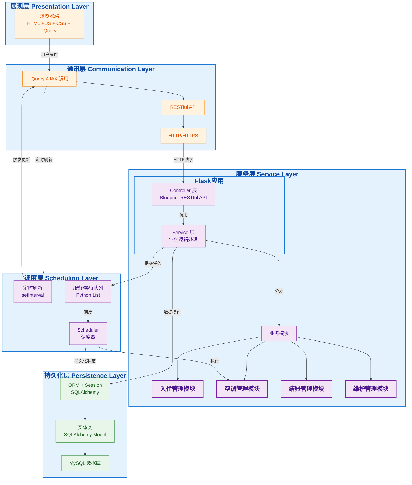

# 1.1 软件架构介绍

## 1.1.1 软件架构介绍

采用B/S架构，前后端分离，前端使用HTML+JS+CSS，后端使用Flask+SQLAlchemy+MySQL，前后端使用jQuery的AJAX进行通信，以下是对软件架构图的介绍：

### 1. 展现层：

- 浏览器端使用原生 HTML/JS/CSS，通过jQuery进行DOM操作和事件处理；

### 2. 通讯层：

- 前端通过 jQuery 的 `$.ajax()` 方法发起 HTTP/HTTPS 请求，调用后端 RESTful API；

### 3. 调度层：

- 前端定时刷新（`setInterval`）：用于实时更新房间状态、温度信息、账单详情等；
- 内存队列（Python List）：实现服务队列（`serving_queue`）和等待队列（`waiting_queue`），基于优先级和时间片进行调度；
- Scheduler：集中管理空调调度逻辑，实现优先级队列（风速优先级：HIGH > MEDIUM > LOW）和时间片轮转（默认120秒）策略；
- 温度模拟计算：基于风速和经过时间自动计算房间温度变化（高风速：1度/1分钟，中风速：1度/2分钟，低风速：1度/3分钟）；

### 4. 服务层：

- Controller 层（Flask Blueprint）：接收并分发 RESTful API 请求，使用 `@Blueprint` 进行模块化路由管理；
- Service 层：编写具体业务逻辑（办理入住、空调服务、结账），并调用调度层；
- 业务模块：模块化设计（入住、空调、结账、账单、维护），便于扩展与维护；

### 5. 持久化层：

- 包含实体类（SQLAlchemy Model）、SQLAlchemy ORM 与 MySQL 数据库，共同完成数据持久化；

## 1.1.2 系统合理性

以下从分层设计、运行机制和框架特点三个维度，结合用例模型与领域模型，以及参考 Django 的 MTV/MVC 思想，说明该系统架构的合理性：

### 1. 分层架构与职责划分

采用典型的 B/S 架构并做前后端分离，实现"五层"清晰职责：

- **展现层（浏览器端 HTML/JS/CSS + jQuery）**：负责页面的可视化与交互，完全脱离业务与数据逻辑。

- **通讯层（jQuery AJAX + RESTful API）**：前端发起的所有操作都通过统一的 HTTP/HTTPS 接口完成，Flask Blueprint 提供模块化的路由管理。

- **调度层（内存队列、Scheduler、前端定时刷新）**：将空调调度、温度模拟和实时更新抽象为一套可配置的机制，实现任务的可靠调度与执行。

- **服务层（Controller + Service + 业务模块化）**：Controller 层作为入口、Service 层执行业务，业务逻辑模块化可插拔。

- **持久化层（SQLAlchemy Model + ORM + MySQL）**：统一通过 ORM 映射实体与表，屏蔽底层 SQL 细节，保障数据一致性与扩展性。

这种分层思路与要求中提出的 UML 分层结构高度吻合，各层职责分明，便于协同开发与后续维护。

### 2. 结合用例与领域模型验证设计合理性

从用例模型看，本系统要支持"使用空调""办理入住""办理结账"三大流程，每个流程都涉及请求发起→调度→服务→记录的完整闭环。

- **请求发起**：通过前端控制面板或营业员界面提交请求（展现层→通讯层），客户、前台、管理员通过不同的页面完成各自的操作。

- **调度决策**：由调度层的内存队列以及调度算法（优先级+时间片）完成资源分配，优先级基于风速，支持时间片轮转和容量限制。

- **服务执行**：Service 层具体执行业务，处理入住登记、空调控制、账单计算等核心业务逻辑。

- **详单记录**：持久化层按照操作契约将详单、账单等写入 MySQL，保证审计可追溯。

整个流程映射到五层架构，每一层只关注自己的"输入—处理—输出"，满足单一职责原则，也与领域模型中各实体类关系一一对应。

### 3. Flask 与 SQLAlchemy 的优势

- **轻量级与灵活性**：Flask 提供了轻量级的 Web 框架，通过 Blueprint 实现模块化路由管理，自动将请求映射到对应的路由处理函数。

- **强大的 ORM 支持**：SQLAlchemy 提供了完整的 ORM 功能，支持关系映射、查询构建、事务管理等，极大减少模板代码，提升开发效率。

- **事务与组件管理**：通过 Flask 的应用上下文和请求上下文管理组件生命周期，Service 层的方法调用都受 Flask 应用上下文统一管理。

- **RESTful API 设计**：使用 Flask Blueprint 组织 RESTful API，每个业务模块都有独立的Blueprint，便于维护和扩展。

- **配置管理**：通过配置文件集中管理配置，支持环境变量覆盖，便于不同环境的部署。

### 4. 调度层的可扩展性与可靠性

- **内存队列实现**：使用Python List实现服务队列和等待队列，按优先级和时间排序，支持动态调整。

- **Scheduler**：集中管理空调调度逻辑，实现优先级队列和时间片轮转策略，支持队列去重、自动补位、时间片轮转等功能。

- **温度模拟计算**：基于风速和经过时间自动计算房间温度变化，支持实时温度更新，当空调关闭时温度会自然回归到默认温度。

- **前端定时刷新**：使用定时刷新机制实现前端实时更新，实时更新房间状态、温度、账单等信息，提升用户体验。

## 1.1.3 系统运行机制

系统运行机制简要如下：

### 1. 应用启动

- Flask 加载配置（`config.py`）、扫描并注册所有 Blueprint，初始化 SQLAlchemy 数据库连接。

### 2. 接收请求

- 浏览器（HTML/JS）通过 jQuery 的 `$.ajax()` 发起 RESTful 请求 → Flask 开发服务器（或生产环境WSGI服务器）捕获 → Flask Blueprint 分发到对应的 Controller 函数。

### 3. 业务调度

- 前端定时刷新（`setInterval`）：按固定间隔（如5秒）触发"定时刷新"（如房间状态、温度、账单等）；
- Scheduler（自定义）：对空调的请求按照"优先级队列 + 时间片轮转"策略调度执行。

### 4. 执行业务

- Controller 调用 Service，Service 内部同步执行业务逻辑；
- Scheduler 管理内存队列（`serving_queue`和`waiting_queue`），根据容量限制和优先级策略分配资源。

### 5. 持久化

- Service/任务调用 SQLAlchemy ORM 操作 MySQL，事务由 `db.session.commit()` 管理，保证一致性。

### 6. 响应返回

- 业务完成后，Controller 将结果序列化为 JSON（通过`jsonify()`），经 Flask 写回前端。

简而言之，就是"启动→接收→调度（内存队列/优先级+时间片）→执行业务（同步）→持久化→响应"的闭环。

## 1.2 分层结构说明

正文：如果需要，根据选择的结构，按照层次的划分进行说明：

1. 哪些对象负责接收前端发过来的请求；
2. 哪些对象负责创建对象的实例；
3. 哪些对象负责处理请求的具体要求；
4. 哪些对象负责数据的同步和存储。

分层结构说明如下：

### 1. 接收前端请求

- **Controller 层（Flask 应用）**
  - Controller 组件位于后端，通过 Flask Blueprint 和路由装饰器（如 `@ac_bp.post()`、`@hotel_bp.get()`）直接暴露 HTTP 接口。
  - 浏览器端的 AJAX 请求（jQuery `$.ajax()` → RESTful API → HTTP/HTTPS）均由它接收，并将请求参数封装成对应的领域对象，传递给下游 Service 层。
  - 主要Controller包括：
    - `ac_controller.py`：处理空调相关请求（开启、关闭、改温度、改风速）
    - `hotel_controller.py`：处理酒店业务请求（入住、退房、查询可用房间）
    - `bill_controller.py`：处理账单相关请求
    - `monitor_controller.py`：处理监控相关请求（房间状态、队列状态）
    - `admin_controller.py`：处理管理员操作请求（房间维护）

### 2. 创建对象实例

- **Flask 应用上下文与模块级单例**
  - 应用启动时，Flask 会初始化应用上下文，Service 层对象通过模块级别的单例模式创建。
  - 在 `services/__init__.py` 中，所有 Service 实例被创建并导出，供 Controller 层使用：
    - `room_service = RoomService()`
    - `scheduler = Scheduler(room_service, bill_detail_service)`
    - `front_desk = FrontDesk(room_service, customer_service, accommodation_fee_bill_service, bill_detail_service)`
    - `maintenance_service = MaintenanceService(room_service, scheduler)`
    - 以及调度层的内存队列（Python List）等实例。
  - SQLAlchemy 的 `db.Model` 类通过继承方式定义，ORM 会在需要时自动实例化模型对象（如 `Room`、`Customer`、`AccommodationFeeBill`、`DetailRecord` 等）。

### 3. 处理请求的具体业务

- **Service 层与业务模块**
  - Service 层是核心的业务逻辑处理点，它会根据接口类型分发到不同的子模块：
    - `FrontDesk` 模块：处理入住登记、房间分配、退房结账的规则。
    - `Scheduler` 模块：负责温度计算、风速优先级判断、计费算法。
    - `AccommodationFeeBillService` 模块：完成结账流程、账单汇总。
    - `MaintenanceService` 模块：处理房间维护状态管理。
  - 调度相关的流程则由 `Scheduler` 组件接管：它从内存队列（Python List 实现的 `serving_queue` / `waiting_queue`）中读取、插入请求，按照"优先级 + 时间片"策略决定何时分配或释放服务对象，并同步调用 Service 完成具体操作。

### 4. 数据的同步与存储

- **持久化层（SQLAlchemy ORM + MySQL）**
  - 各种业务操作产生的状态变更（如入住信息、温度记录、计费明细）由 SQLAlchemy ORM 映射到对应的数据库表，最终存储于 MySQL。
  - 调度层采用内存队列（Python List）维护队列状态，同时将关键状态（如房间的 `serving_start_time`、`waiting_start_time`）持久化到数据库，确保内存队列状态与持久化数据一致。
  - `Scheduler` 在服务重启时会通过 `_restore_queue_from_database()` 方法从数据库恢复队列状态，保证系统重启后队列状态的连续性。

- **前端定时刷新机制（类比消息队列）**
  - 前端使用 `setInterval` 实现定时刷新机制，用于在各组件间广播事件（房间状态更新、温度变化、账单更新），保证系统内状态变更能够被前端界面实时捕获和展示，实现类似消息队列的实时通知效果。

## 1.3 软件架构示意图

软件架构示意图如下：

